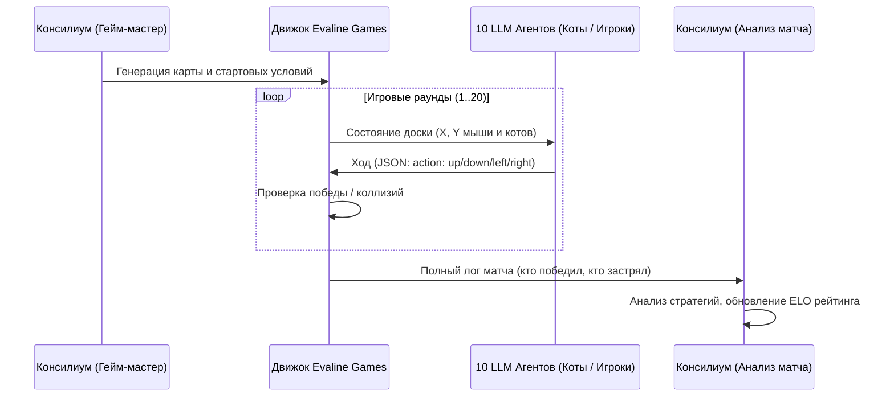

# ИНТЕГРАЦИЯ EVALINE GAMES С EVALINE CONSILIUM

Архитектура объединения игрового движка с мозговым центром консилиума.

---

## 1. Зачем связывать Консилиум и Игры?
1. **Самообучение и бенчмарк моделей:** Игры создают интерактивную среду с четкими правилами и победами/поражениями. Модели учатся тактическому взаимодействию.
2. **Консилиум как Гейм-мастер (GM):**
   - Консилиум генерирует сценарии, квесты и сюжеты на основе реальной деятельности Evaline (например: "Кризис на таможне в Братиславе", "Охота за браком на линии ЭВА листов").
3. **Разбор полетов (Post-Game Consilium):**
   - После завершения матча лог игры отправляется в Консилиум.
   - Агенты (Критик, Тренер, Аналитик) разбирают ошибки моделей и дают им рекомендации на следующий раунд.

---

## 2. Схема взаимодействия

---

## 3. Концепт игры «Коты Evaline» (Cat-Chase Realtime)
- **10 Котов (LLM-моделей):** Каждый кот обладает своей специализацией и характером (Охотник, Засадник, Аналитик).
- **Мышь:** Быстрый алгоритмический или легковесный LLM-агент, убегающий от скоплений.
- **Окружение:** Склад готовой продукции Evaline (штабеля ЭВА листов, рулоны татами как препятствия).
